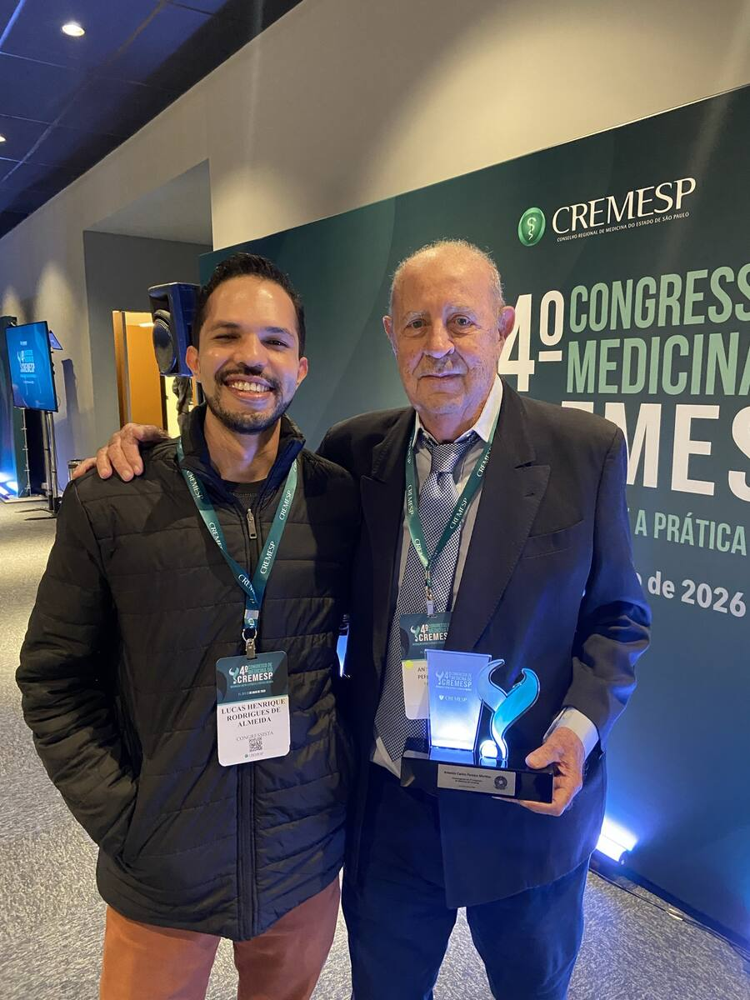

# Saúde na Última Semana — Revista Eletrônica VIA

**Edição de 20 de setembro de 2026**

**Semana de 13 a 20 de setembro de 2026**

**Curadoria médico-científica · saúde pública, cuidado, ciência e tecnologia**

> O fio da semana não é a tecnologia em si. É a qualidade da cadeia que transforma possibilidade em cuidado.

## Em 90 segundos

- Obesidade não é uma questão cosmética de peso: é doença crônica, recidivante e sistêmica, cuja avaliação não cabe no IMC isolado.
- O Ministério da Saúde anunciou intenção de oferecer medicamentos para obesidade no SUS, mas o fato regulatório ainda é estudo, avaliação de tecnologia e definição de protocolo.
- O Real-Bari acompanha 250 pacientes no Grupo Hospitalar Conceição; o resultado de um participante não sustenta, sozinho, uma política nacional.
- A Anvisa proibiu a T36 por ausência de registro e de avaliação nacional de segurança e eficácia.
- O 40º Congresso do CREMESP de 2026 homenageou o Prof. Antônio Carlos Pereira Martins, primeiro transplantador renal com doador cadáver na FMRP-USP.
- O vídeo **Engenharia epistêmica**, do canal do autor, entra como extensão da edição: ferramenta capaz de responder também precisa saber quando não decidir.

## 1. Medicina, memória e reconhecimento

O 40º Congresso do CREMESP de 2026 homenageou o **Prof. Antônio Carlos Pereira Martins**, primeiro transplantador renal com doador cadáver na FMRP-USP. A homenagem abre esta edição como lembrança de que inovação clínica também é continuidade: conhecimento acumulado, trabalho em equipe e responsabilidade entre gerações.

## 2. Antes das “canetas”: do que estamos tratando quando falamos em obesidade?

Chamá-las de “canetas emagrecedoras” é um enquadramento insuficiente para política de saúde. O objeto em discussão é o tratamento farmacológico da obesidade, uma doença crônica, recidivante e sistêmica associada ao excesso ou à disfunção do tecido adiposo, com repercussões metabólicas, cardiovasculares, mecânicas, funcionais e inflamatórias.

O tecido adiposo é metabolicamente ativo. O IMC continua útil como ferramenta epidemiológica e de triagem, mas não descreve composição corporal, distribuição da adiposidade nem dano orgânico.

Isso muda a pergunta sobre agonistas incretínicos. Se obesidade fosse apenas excesso de peso, bastaria discutir quantos quilos se perdem. Quando reconhecida como doença sistêmica, a pergunta correta é: em quais pacientes o tratamento modifica doença, complicações, função, risco cardiovascular e trajetória clínica — e a que custo, risco e necessidade de acompanhamento?

### Obesidade sarcopênica

É o fenótipo em que excesso de adiposidade coexiste com baixa massa e função muscular. Peso e IMC isolados podem esconder o componente de maior risco funcional; a avaliação deve integrar função muscular e composição corporal.

**Fontes:** [EASO — framework de diagnóstico, estadiamento e manejo](https://doi.org/10.1038/s41591-024-03095-3); [ESPEN/EASO — consenso sobre obesidade sarcopênica](https://pubmed.ncbi.nlm.nih.gov/35227529/).

## 3. Medicamentos para obesidade no SUS: o anúncio chegou antes da incorporação

Em 17 de setembro, durante agenda em Montes Claros, o Ministério da Saúde apresentou a futura oferta de medicamentos para obesidade no SUS como um direito a ser construído de forma responsável. O comunicado oficial descreve avaliação, estudo em andamento e preparação de protocolo — não uma incorporação já concluída.

Entre as iniciativas citadas está o Real-Bari, no Grupo Hospitalar Conceição, que acompanhará 250 pacientes com obesidade grave ou associada a outras morbidades. Um resultado individual, como a perda ponderal divulgada de um participante, é observação clínica inicial; não é evidência suficiente para uma política nacional.

O precedente permanece relevante: em setembro de 2025, a Conitec tornou pública a decisão de não incorporar a semaglutida para pacientes com obesidade graus II e III, sem diabetes, a partir de 45 anos e com doença cardiovascular estabelecida. Uma intenção ministerial nova não apaga a necessidade de nova avaliação formal.

**Fontes primárias:** [Ministério da Saúde, 17/09/2026](https://www.gov.br/saude/pt-br/assuntos/noticias-ms/2026/setembro/canetas-emagrecedoras-serao-disponibilizadas-de-forma-responsavel-no-sus-diz-ministro); [Portaria SECTICS/MS nº 65, de 15/09/2025](https://www.gov.br/conitec/pt-br/midias/relatorios/portaria/2025/portaria-sectics-ms-no-65-de-15-de-setembro-de-2025).

## 4. T36: quando a demanda por acesso encontra o limite sanitário

Em 16 de setembro, a Anvisa proibiu importação, armazenamento, distribuição, comercialização, propaganda e uso da T36. O produto não possui registro sanitário no Brasil e não teve sua segurança e eficácia avaliadas pela Agência.

O contraste é o centro desta edição: nem acesso sem regulação, nem regulação indiferente ao problema de acesso. Registro, incorporação ao SUS e prescrição clínica respondem a perguntas diferentes; colapsá-las numa palavra — “liberação” — só produz desinformação com verniz de pressa.

**Fonte primária:** [Anvisa — proibição da T36 e Resolução-RE nº 3.626/2026](https://www.gov.br/anvisa/pt-br/assuntos/noticias-anvisa/2026/anvisa-proibe-caneta-emagrecedora-t36).

## 5. Engenharia epistêmica: saber quando não decidir

O mesmo problema aparece na IA clínica. Um modelo capaz de responder não é necessariamente capaz de reconhecer quando não deveria responder. Benchmark, fluência e confiança verbal não substituem rastreabilidade, possibilidade de abstenção e autoridade humana explícita.

[Assistir a **Engenharia epistêmica**, no canal Dr Lucas HR](https://youtu.be/5XiIHabeIck).

O vídeo não é ornamento externo: é conteúdo editorial do autor e extensão conceitual desta edição.

## O que a VIA leva desta semana

- Anunciar acesso não é incorporar uma tecnologia.
- Estudar uma tecnologia não é demonstrar benefício em qualquer população.
- Autorizar um produto não equivale a recomendar seu uso para todos.
- Um sistema de IA útil precisa tornar possível a recusa, a abstenção e a revisão humana.
- Acelerar um processo só é avanço se a velocidade não apagar as etapas que existem para descobrir quando estamos errados.

Ciência e tecnologia entram no cuidado por uma cadeia de decisões. A qualidade dessa cadeia talvez importe tanto quanto a novidade que circula por ela.

## Método editorial

Fatos regulatórios e institucionais foram conferidos em fontes primárias. Declaração ministerial, protocolo de pesquisa, decisão de incorporação e autorização sanitária são categorias distintas. A edição preserva essa separação.

Material educativo. Não substitui avaliação clínica individual, protocolo assistencial, norma sanitária nem fonte epidemiológica em tempo real.
